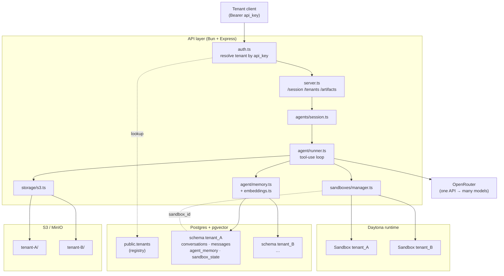
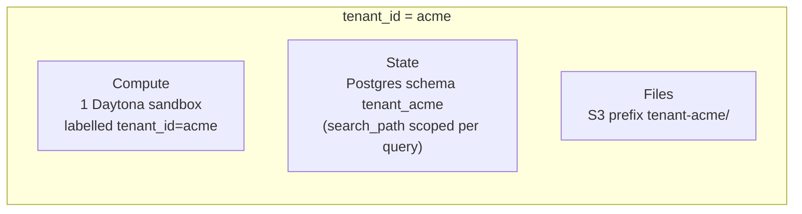
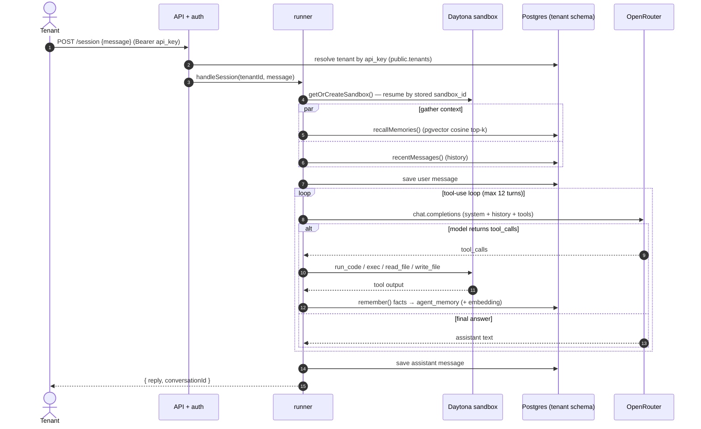
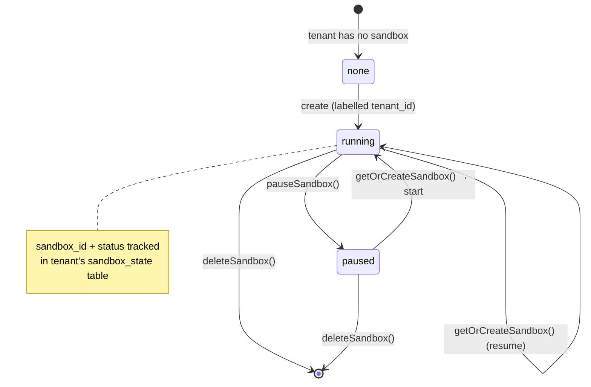

# Architecture

How agent-sandbox isolates a persistent AI agent per tenant. Diagrams use
[Mermaid](https://mermaid.js.org/) and render on GitHub.

## 1. System overview

The API is the only component that talks to everything; each tenant's compute
(Daytona sandbox), state (Postgres schema), and files (S3 prefix) are separate.

## 2. Isolation model — the core idea

Every tenant is fenced off on three axes. The tenant id (`[a-z0-9_]+`,
validated) is the key that ties the three together.

| Axis | Mechanism | Where |
|------|-----------|-------|
| Compute | One persistent Daytona sandbox per tenant, labelled `tenant_id` | `src/api/sandboxes/manager.ts` |
| State | One Postgres **schema** `tenant_{id}`; every query runs with `SET search_path` | `src/api/db.ts` (`withTenant`) |
| Files | One S3 **prefix** `tenant-{id}/` | `src/api/storage/s3.ts` |

A cross-tenant query is impossible by construction: tenant-scoped DB access only
happens inside `withTenant(tenantId, …)`, which sets the search path; the
registry that maps api_key → tenant lives in the separate `public` schema.

## 3. Per-session flow

What happens on `POST /session` with a tenant's bearer key:

Key persistence points: the sandbox is **resumed** (not recreated) via the
`sandbox_id` in `sandbox_state`; conversation and remembered facts are written
back to the tenant's schema — so the next session continues with full context.

## 4. Sandbox lifecycle

If the recorded sandbox no longer exists in Daytona, `getOrCreateSandbox()`
transparently provisions a fresh one and updates `sandbox_state`.

## Why these choices

- **Schema-per-tenant** (not row-level `tenant_id` columns) gives hard isolation
  and trivial per-tenant export/drop, while sharing one Postgres instance and
  the `pgvector` extension.
- **One sandbox per tenant** makes the agent stateful — its filesystem and
  installed tools persist — which is the whole point versus a throwaway runner.
- **OpenRouter** keeps the model a config value, so cost/quality is tuned via
  `AGENT_MODEL` without touching code.
